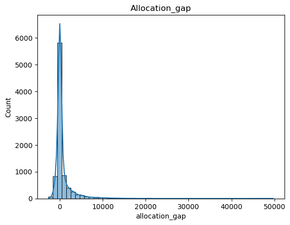

# Quantities Requested vs Approved Quantity Analysis

## Overview

This project investigates whether the **the quantities of malaria commodities requested by health facilities differ significantly from the quantities approved by the national program**.
➡️ See full analysis details on notebook file:  
[Hypothesis testing](hypo_testing_qty_reqvsapp.ipynb)

The analysis helps to determine whether the approval process systematically adjusts facility requests. Beyond assessing the overall allocation process, the analysis also examined whether allocation behavior varies across malaria product groups and facility types, thereby providing operational insights into the consistency of national allocation practices.

Because the exploratory data analysis revealed:

- highly skewed distributions
- heavy-tailed allocation gaps
- and numerous operational outliers
  The assumptions required for parametric hypothesis tests were not satisfied, consequently:
- a non-parametric statistical framework was adopted, using the Wilcoxon Signed-Rank Test
- a bootstrap confidence intervals to quantify the uncertainty around the sample statistic

## 2.Key findings

### Problem Statement

The National program aims to allocate malaria commodities according to facility demand. However, it is important to determine whether the approved quantities systematically differ from the requested quantities and whether this allocation behavior remains consistent across different product groups and type of facilities.

### Analytical Approach

The analysis was conducted in three successive stages:

- Assessment of statistical assumptions to identify the most appropriate hypothesis test.
- Global comparison of requested and approved quantities across all facilities and malaria commodities.
- Stratified analyses by product group and facility type to determine whether the observed allocation behavior remained consistent across these groups.
  Key Results

## 3.Key Results

### 3.1.Allocation differences are statistically significant at the national level

The global hypothesis test demonstrated an extremely significant difference between requested and approved quantities (p < 0.001), indicating that the allocation process does not simply reproduce facility requests but systematically modifies them. The estimated median allocation gap was 9 units, with a 95% bootstrap confidence interval of 7–12 units, indicating that facilities typically receive additional quantities beyond those requested, at least a median of 7 additional units beyond their requested quantities.

### 3.2.Allocation behavior is consistent across malaria product groups

The stratified analyses showed that every malaria product group (ACT, ART, PREV, PYRA and SP) exhibited a statistically significant positive allocation gap (all p < 0.05). Median allocation gaps ranged from 6 units (SP) to 14 units (PYRA), indicating that facilities typically receive additional quantities beyond those requested, at least a median of 6 for SP and 14 additional units beyond their requested quantities.

Confidence intervals were entirely positive for every product group and overlapped substantially, indicating that although the magnitude of the allocation gap varies slightly, the overall allocation behavior remains broadly similar across malaria commodities. These findings suggest that the national allocation pattern is not driven by a particular product category but represents a consistent operational practice across the malaria supply chain.

### 3.3.Allocation behavior is also consistent across facility types

District Hospitals, Health Centers and Regional Hospitals all showed statistically significant positive allocation gaps (all p < 0.05), indicating that approved quantities generally exceed requested quantities regardless of facility level.
National Hospitals represented the only exception, where no statistically significant difference was detected. However, this subgroup contained only 46 paired observations, limiting statistical power and preventing firm conclusions.

Confidence intervals similarly indicated positive allocation gaps for the three principal facility categories, while the wider confidence interval observed for Regional Hospitals reflected greater uncertainty due to the smaller sample size.

Overall, the confidence intervals overlapped substantially, suggesting no strong descriptive evidence of meaningful differences in allocation behavior across facility types.

## Conclusion

The analysis demonstrates that:

- National allocation decisions differ systematically from facility requests.
- The observed allocation gap is consistently positive across almost product group and facility type.
- The allocation pattern is not limited to a particular malaria commodity or facility level.
- The consistency of the confidence intervals suggests that the national program applies a broadly uniform allocation policy throughout the malaria supply chain

Together, these findings indicate that the allocation process reflects a systematic operational policy rather than random variation in commodity distribution.

## Recommendations

The hypothesis testing has demonstrated what is happening, but not why. Nevertheless, it already provides valuable evidence for improving the malaria supply chain.

### 1.Review and document allocation policy

The National program does not simply fulfill facility orders; it applies a centralized allocation policy.
There is a need to document and evaluate the business rules used for allocation, such as:

- stock availability
- redistribution priorities
- buffer stock policy
- maximum stock limits
  This will help to develop standardized allocation guidelines so that similar facilities with similar demand are treated consistently.

### 2.Investigate of the extreme allocation gaps

As some orders receive substantially more stock than requested, there is a need to establish automatic monitoring of unusually large allocation gaps to determine whether they result from:

- data entry errors
- emergency distributions,
- redistribution activities
- campaign supplies
- inappropriate allocation decisions
