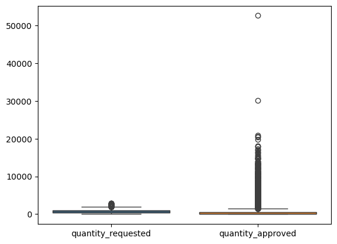
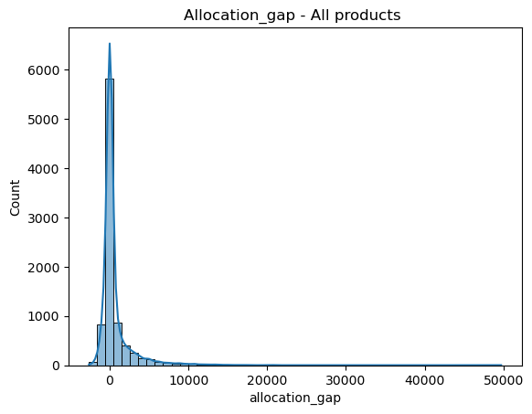
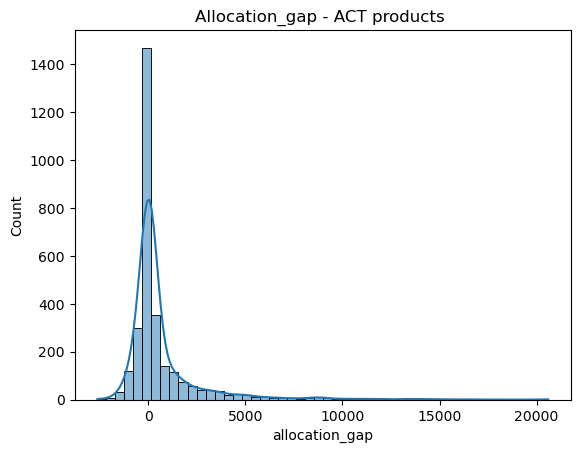
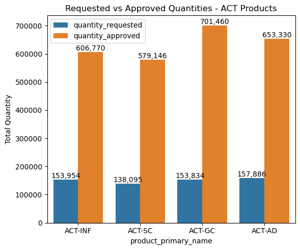
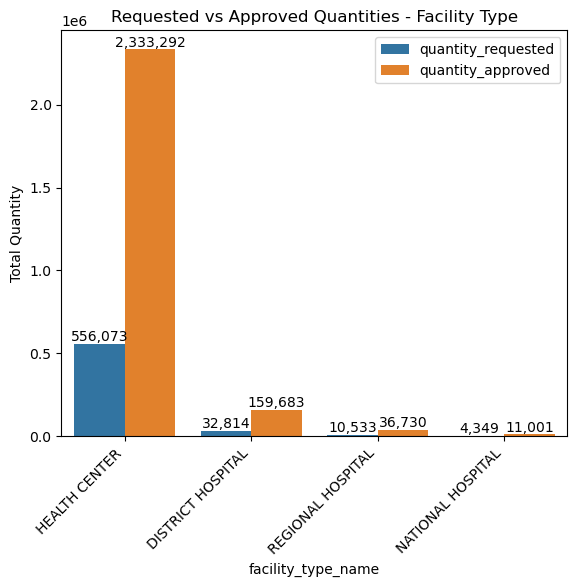

# Executive Summary - EDA for Allocation Hypothesis Testing

## 1.Overview

This Exploratory Data Analysis (EDA) was conducted to prepare the dataset for project 1, which aims to determine whether the quantities of malaria commodities requested by health facilities differ significantly from the quantities approved by the national Medical Store.

The EDA focused on understanding the statistical characteristics of the key study variables, identifying potential data quality issues, evaluating the distribution of allocation differences, and assessing whether the assumptions required for hypothesis testing are reasonably satisfied.

Particular attention was given to understanding the operational meaning of extreme allocation values in the context of the malaria supply chain before applying inferential statistical methods.

## 2.Key Insights

### Problem Statement

A fundamental question in this project is to understand whether health products approved by the national programs reflect the actual quantities requested by health facilities. While descriptive reports often compare requested and approved quantities, they do not determine whether the observed differences are statistically significant or simply reflect normal operational variability.

Furthermore, malaria commodity allocation is influenced by multiple operational factors—including emergency distributions, redistribution activities, campaign logistics, and facility capacities. That may affect the true relationship between facility demand and national allocation decisions.

Before conducting formal hypothesis testing, it was therefore necessary to understand the statistical behavior of the data and distinguish normal operational phenomena from potential data quality issues.

### Proposed Solution

A comprehensive EDA was performed to characterize the dataset from both statistical and supply chain perspectives. The analysis included:

- Assessment of missing values
- Descriptive comparison of requested and approved quantities
- Visualization of distributions
- Quantification of allocation gap outliers
- Stratified outlier analysis by product groups and facility types;
- Demand and allocation profiling to identify the commodities and facility types driving allocation decisions.

Particular emphasis was placed on the ACT product group, which represents the principal first-line treatment for uncomplicated malaria and accounts for a substantial proportion of routine malaria demand.

The analyses conducted for the remaining product groups (PYRA, ART, SP and PREV) exhibited very similar statistical behavior, indicating that the ACT findings are broadly representative of the overall allocation process. Additional analysis of these groups may therefore be considered as complementary exercises where more product-specific insights are required.

### Key Successes of the EDA

The exploratory analysis successfully achieved its objectives by:

- Distinguishing operational missing values from genuine data quality issues
- Identifying a valid analytical dataset suitable for paired comparisons
- Demonstrating that most extreme observations correspond to operational supply chain events rather than erroneous data
- Showing that many apparent outliers disappear when observations are compared within homogeneous products and facility groups

## 3.Key Findings

### 3.1.Data Quality Assessment

The missing value analysis demonstrated that many missing observations are explained by the quarterly ordering process rather than poor data quality. Records where both requested and approved quantities were absent were interpreted as non-ordering events.
A total of 8,763 relevant allocation records were retained for descriptive analyses, while paired hypothesis testing will focus on observations where both requested and approved quantities are available.

#### 3.2.Distribution of Requested and Approved Quantities

The descriptive statistics revealed substantial differences between the two variables. Although the average approved quantity exceeded the average requested quantity (833 > 745), the median approved quantity remained considerably lower than the median requested quantity (42 < 639) indicating a highly skewed allocation distribution driven by a relatively small number of exceptionally large approvals.

#### 3.3.Allocation Gap Analysis

The allocation gap (Approved − Requested) exhibited a strongly right-skewed distribution. These results indicate that most allocation events differ only slightly from facility requests, while a relatively small number of observations receive substantially larger allocations, producing the long positive tail observed throughout the dataset.
| Indicator | Result |
| ----------------------- | ---------------------: |
| Upper outlier threshold | 1,065 units |
| Outliers detected | 2,167 observations |
| Outlier proportion | 24.7% |

#### 3.4.Stratified Outlier Analysis (Focus on ACT Products)

When observations were analysed within homogeneous ACT products and facility types, the proportion of outliers decreased from approximately 24.7% globally to between 16% and 19%, demonstrating that much of the apparent variability was also explained by structural differences between products and facilities ratherand not only by abnormal allocation behavior.
The ACT group further revealed that:

- allocation gaps remained concentrated around zero;
- approximately 25% of Health Centre, District Hospital and Regional Hospital observations showed no positive allocation gap, indicating complete fulfillment of many routine orders;
- National Hospitals exhibited a different pattern, although conclusions remain limited due to the very small sample size.

Histogram confirmed that most allocation events clustered around zero, while relatively few observations generated the long positive tail extending to nearly 20,000 units.

Similar distributional patterns were observed across the PYRA, ART, SP and PREV groups, suggesting that the allocation behavior identified within ACT products is representative of the broader malaria commodity supply chain

#### 3.5 Demand and Allocation Profiling

Demand profiling showed that ACT formulations exhibit remarkably balanced ordering activity.

Across the four ACT formulations:

- the difference in the number of orders was less than 4%;
- total requested quantities differed by only 13.4%;
- average quantities requested per order remained relatively similar

Similarly, approved quantities were distributed consistently across ACT products, although approved totals were approximately four to five times larger than recorded requested quantities. Allocation ratios ranged from 3.9 to 4.6, suggesting that the Medical Store distributes substantially more ACT commodities than are captured through the routine ordering workflow.

At facility level:

- Health Centres generated approximately 92% of all requested quantities;
- Health Centres also received approximately 92% of all approved quantities;
- approximately 93% of all ACT orders originated from Health Centres.
  

These findings demonstrate that Health Centres dominate both demand and allocation patterns and are therefore expected to exert the greatest influence on the overall hypothesis testing results.

## 4. Next Steps

The EDA provides strong evidence that the dataset is suitable for inferential analysis while highlighting several characteristics that should guide the statistical methodology.

The next phase of the study will therefore focus on:

1. Preparing the paired analysis dataset by restricting the hypothesis test to observations containing both requested and approved quantities.
2. Assessing statistical assumptions, including the normality of allocation differences, to determine whether a paired t-test or a non-parametric alternative such as the Wilcoxon Signed-Rank Test is most appropriate.
3. Testing the global hypothesis to determine whether approved quantities differ significantly from requested quantities across the entire dataset.
4. Conducting stratified analyses by product group (beginning with the ACT group) and facility type to determine whether allocation behavior differs across operational contexts.
5. Estimating effect sizes and confidence intervals to quantify the practical importance of any statistically significant differences identified.

Together, these analyses will establish whether the observed differences between requested and approved quantities represent statistically significant allocation behavior and provide evidence to support improvements in malaria commodity planning and distribution.
