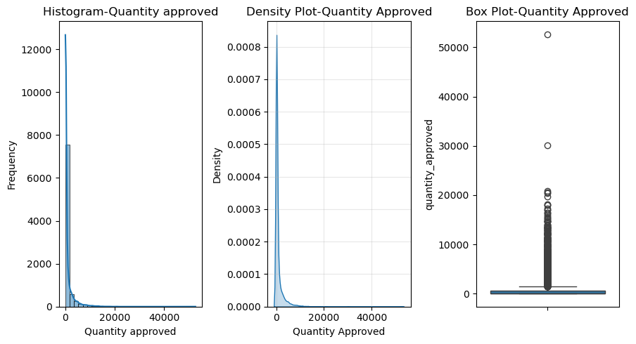

# Executive Summary - EDA for Order Quantity Prediction

## 1.Overview

This Exploratory Data Analysis (EDA) was conducted to prepare the dataset for project 2, wo prepare an analytical dataset for the development of an Order Quantity Prediction Model for malaria commodities.

The objective of the predictive model is to answer the following question:
Can we predict the quantity of malaria commodities that will actually be approved by the central supply chain?

Unlike the previous EDA, which focused on determining whether quantities requested by health facilities differ from quantities approved at the central level, this analysis focuses on identifying and engineering the variables that can best explain quantity_approved.

The EDA was designed to support the development and comparison of three predictive approaches: Multiple Linear Regression (MLR), Decision Tree Regression, and Random Forest Regression. It therefore examined the distribution of the target and predictor variables, categorical structures, predictor-target relationships, and opportunities for feature transformation and extraction.

## 2.Key Insights

### Problem Statement

Malaria commodity allocation decisions depend on multiple interconnected supply chain factors, including historical consumption, current stock availability, quantities received and dispensed, inventory adjustments, product characteristics, facility characteristics, geographic context, and seasonality.

Consequently, predicting the quantity that will be approved cannot necessarily be reduced to a simple linear relationship with one individual inventory variable.

The purpose of this EDA was therefore to move from the raw eLMIS variables toward a modeling-ready dataset that captures both the statistical characteristics of the data and the operational mechanisms that may influence central-level allocation decisions.

### Proposed Solution

A comprehensive EDA was performed to prepare the dataset for the development of predictive models for quantity_approved, combining statistical exploration with the operational context of malaria commodity allocation. The analysis included:

- Target variable analysis to characterize the distribution, variability, skewness, kurtosis, and extreme values of quantity_approved
- Continuous independent variable exploration to assess the characteristics of inventory-related predictors such as quantities received and dispensed, stock on hand, AMC, losses and adjustments, and quantity requested
- Categorical variable analysis to assess category frequency, representation, imbalance, and differences in average approved quantities across products, reporting periods, facility types, and geographic zones
- Predictor–target relationship analysis using graphical methods to examine potential linear and non-linear relationships between continuous predictors and quantity_approved, while also identifying possible relationships among predictors
- Feature engineering, combining feature selection, transformation, and extraction to simplify existing variables and derive operationally meaningful predictors such as reporting month, product group, facility category, Urban/Rural classification, High Transmission Preparation, Months of Stock, and Stock Status

### Key Successes of the EDA

The exploratory analysis successfully achieved its objectives by:

- Established that the prediction problem contains substantial skewness, extreme observations, categorical structure, seasonality, and potentially non-linear predictor-target relationships
- Converted several raw eLMIS variables into supply-chain-oriented features such as transmission-preparation period, Months of Stock that are more directly interpretable for decision support

The EDA therefore provides a structured and operationally meaningful dataset suitable for testing progressively more flexible predictive algorithms.

## 3.Key Findings

### 3.1.Target Variable Characteristics

The target variable, quantity_approved, exhibits substantial variability. The target variable distribution is strongly right-skewed and the histogram, density plot, and boxplot further demonstrate that most observations are concentrated at relatively small approved quantities while a limited number of observations correspond to exceptionally large allocations.

These characteristics do not in themselves invalidate Multiple Linear Regression, because regression does not require the response variable to be normally distributed. However, they indicate that residual normality, linearity, homoscedasticity, and influential observations will require careful assessment after fitting the baseline model.

Tree-based models are expected to be less sensitive to these distributional characteristics.

#### 3.2.Numerical Predictor Characteristics

Most numerical predictors including quantity_received, quantity_dispensed, stock_in_hand, and AMC exhibit right-skewed distributions and extreme observations. In contrast, total_losses_and_adjustments is approximately symmetric, while quantity_requested displays a less pronounced positive skew than the other inventory variables.

The graphical analysis indicates that the relationship between individual numerical predictors and quantity_approved is generally weak, irregular, or non-linear.

Relationships are also visible among the predictors themselves, particularly between AMC and quantity dispensed, indicating potential multicollinearity that should be formally investigated before interpreting the Multiple Linear Regression model.

These findings support retaining MLR as an interpretable baseline, while providing a strong rationale for evaluating Decision Tree and Random Forest models capable of learning non-linear relationships and interactions.

#### 3.3.Categorical Predictor Characteristics

The categorical analysis identified several operational dimensions potentially relevant to approval decisions.

The 12 individual products are relatively well represented, with no rare product categories. Reporting periods are similarly balanced across the dataset. In contrast, facility type is strongly dominated by Health Centers, which represent more than 92% of observations, while National Hospitals are substantially underrepresented.

The original geographic variable contains 37 districts, creating relatively high categorical dimensionality if directly one-hot encoded.

Based on these findings, several transformations were identified to simplify the dataset while retaining operational meaning:

- facility types are consolidated into Health Center and Hospital
- the 37 districts are transformed into the higher-level Urban/Rural (zone_type) classification
- complete reporting dates are replaced by reporting month, preserving the February, May, August, and November ordering cycle;
- dispensing_unit is excluded as a direct predictor because it primarily describes a physical product characteristic rather than an identified driver of central allocation.

These transformations reduce dimensionality while preserving variables with interpretable relationships to supply chain operations.

#### 3.4.Operational Feature Engineering

A major outcome of the EDA was the extraction of features that translate raw inventory data into variables with stronger operational meaning.

- Product Group reduces individual products into six broader groups—ACT, PYRA, ART, SP, PREV, and DIAG—based on clinical function and logistics characteristics.
- High Transmission Preparation captures ordering periods associated with preparation for expected increases in malaria transmission, allowing the models to incorporate seasonality beyond the reporting month itself
- Months of Stock (MoS) combines stock on hand and Average Monthly Consumption
- Stock Status translates MoS into operational categories such as Stockout, Critical, Low, Adequate, and Overstock, allowing inventory position to be represented using thresholds familiar to supply chain planners

Together, these engineered features shift the modeling dataset from a collection of raw transactional variables toward a representation of the operational conditions under which allocation decisions are made.

#### 3.5 Final Modeling Dataset

Following feature selection, transformation, and extraction, the modeling dataset will contain a combination of raw inventory indicators and engineered operational features:

1. product
2. product_group
3. facility_type
4. reporting_month
5. High_Transmission_Preparation
6. zone_type
7. beginning_balance
8. quantity_received
9. quantity_dispensed
10. total_losses_and_adjustments
11. stock_in_hand
12. months_of_stock
13. stock_status
14. amc
15. quantity_approved

The resulting dataset provides a common analytical foundation for comparing Multiple Linear Regression, Decision Tree, and Random Forest models.

## 4. Next Steps

The next phase will focus on building and evaluating the predictive models. The workflow should include:

1. Finalize preprocessing, including treatment of undefined Months of Stock values, categorical encoding, and train/test preparation
2. Develop Multiple Linear Regression as the baseline model and evaluate its assumptions
3. Develop a Decision Tree Regression model to capture non-linear relationships and threshold effects
4. Develop a Random Forest Regression model to capture more complex interactions while reducing the instability associated with a single decision tree
5. Compare model performance on unseen data using metrics such as MAE, RMSE, and R², alongside operational interpretability.
6. Analyze feature importance and model errors across products, facility types, reporting periods, and stock conditions

The final objective is not simply to identify the algorithm with the highest statistical accuracy, but to determine whether routine logistics and inventory information can be transformed into a reliable and interpretable decision-support model for predicting central-level malaria commodity allocations.
