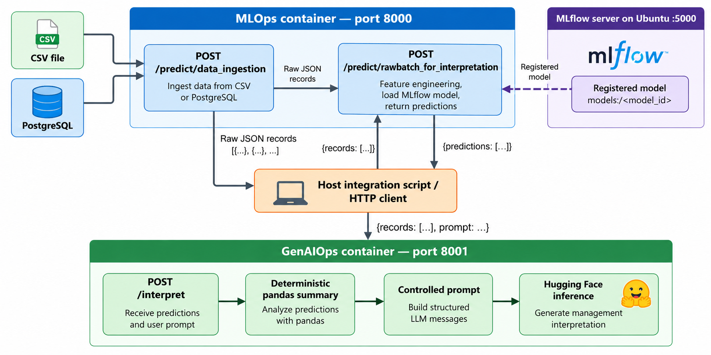

# Project 4 — GenAIOps Interpretation of Malaria Supply Chain Predictions

📁 **Directory:** `genaiops/`

## Objective

This project extends **Project 3 — MLOps Deployment of the Malaria Order Prediction Model** by adding a separately deployable generative-AI interpretation service. The existing MLOps API ingests CSV/PostgreSQL logistics data, performs feature engineering and ML inference, and returns prediction records. GenAIOps transforms those records into a deterministic analytical summary, constructs a controlled prompt, and requests a management-oriented interpretation from Hugging Face.

**Design boundary:** MLOps owns ingestion, preprocessing, prediction and MLflow integration. GenAIOps owns summarization, prompt construction and language-model interpretation. The existing test scripts orchestrate calls between the APIs; the GenAIOps `/interpret` endpoint does **not** itself ingest data or call MLOps.

| Tool | Purpose |
|---|---|
| Python 3.11 | Local and container runtime |
| FastAPI / Uvicorn | GenAIOps REST service, port 8001 |
| Pydantic | Request/response validation |
| pandas | Deterministic summary of predicted records |
| Hugging Face Inference API | LLM-backed interpretation |
| `openai/gpt-oss-20b` | Configured interpretation model |
| Docker / Docker Compose | Packaging and orchestration |
| MLOps FastAPI | Ingestion and prediction, port 8000 |
| MLflow on Ubuntu host | MLOps registered-model retrieval, port 5000 |

## Integrated architecture



The MLOps and GenAIOps APIs are independently deployable. **The client/test script is the current orchestrator**; direct MLOps-to-GenAIOps HTTP calls are not part of the three supplied test scripts.

---

# Technical Documentation

## 1. Project Structure

The following shows the key paths used by the supplied tests; it is not intended to document every source file.

```text
data-analytics-project/
├── docker-compose.yml
├── mlops/
│   ├── .env.docker
│   └── data/raw/requisition_dashboard.csv
└── genaiops/
    ├── requirements.txt
    ├── Dockerfile
    ├── .dockerignore
    ├── .env.docker
    ├── src/
    │   ├── api/main.py
    │   ├── processing/dataframe_summary.py
    │   ├── prompts/interpretation.py
    │   └── llm/generator.py
    └── tests/
        ├── sample_data.py
        ├── test_interpretation_pipeline.py
        ├── test_real_pipeline_api.py
        └── test_source_api_integration.py
```

## 2. Runtime and Compatibility

The deployment target is **Ubuntu 20.04**, with **Python 3.11** and the existing compatible Docker Engine/Compose installation. The MLOps model and MLflow run separately from GenAIOps. Keep dependency versions consistent with the project's tested `requirements.txt` files.

```bash
python3.11 --version
docker version
docker compose version
```

---

# Part A — GenAIOps + FastAPI

## 3. Prepare the Local Ubuntu Environment

Run from the repository root:

```bash
cd /home/user/dev/data-analytics-project/genaiops
python3.11 -m venv .venv
source .venv/bin/activate
python -m pip install --upgrade pip setuptools wheel
python -m pip install -r requirements.txt
```

The three supplied scripts are intended to be executed **from `genaiops/`**, because they import `src` and/or `tests`, and one uses the relative path `../mlops/data/raw/requisition_dashboard.csv`.

## 4. Configure Hugging Face

Use the GenAIOps environment file `genaiops/.env.docker` for Docker and configure the same variables for local Ubuntu execution (through your application's `.env` loader or exported shell variables):

```dotenv
HF_TOKEN=<REPLACEMENT_HF_TOKEN>
HF_MODEL_ID=openai/gpt-oss-20b
HF_PROVIDER=auto
HF_MAX_TOKENS=1200
HF_TEMPERATURE=0.1
```

**Security:** A previously shared Hugging Face token should be revoked and replaced. Never commit real `.env` or `.env.docker` files. When running a test directly on Ubuntu, Docker Compose's `env_file` does not automatically populate the host shell. If the application does not load a local `.env` automatically, load environment variables explicitly:

```bash
# Run in genaiops/; requires a trusted shell-compatible .env.docker file.
set -a
source .env.docker
set +a
```

## 5. Start and Test GenAIOps Locally

```bash
cd /home/user/dev/data-analytics-project/genaiops
source .venv/bin/activate
python -m uvicorn src.api.main:app --host 127.0.0.1 --port 8001 --log-level info
```

In another terminal:

```bash
curl -i http://127.0.0.1:8001/health
```

Swagger UI: `http://127.0.0.1:8001/docs`.

A successful health check verifies API responsiveness, **not** successful Hugging Face inference.

## 6. API Endpoints and Data Contracts

### 6.1 MLOps — `POST /predict/data_ingestion`

**URL:** `http://127.0.0.1:8000/predict/data_ingestion`

**Purpose:** Retrieve raw logistics records from the source selected by the caller. This endpoint is called **only** by `test_source_api_integration.py` among the three supplied scripts.

**Request:**

```json
{"source":"csv"}
```

To test PostgreSQL, change the request value to `"postgres"` and configure the MLOps database variables and `DATA_POSTGRES_QUERY`.

**Response shape used by the test:** a **top-level JSON array** of raw record objects:

```json
[
  {
    "record_id":"REQ-001",
    "product_primaryname":"ACT-AD",
    "processing_periods_name":"May 2025",
    "facility_type_name":"health center",
    "beginningbalance":100,
    "quantityreceived":50,
    "quantitydispensed":80,
    "stockinhand":70,
    "totallossesandadjustments":0,
    "amc":35,
    "zone":"DISTRICT1"
  }
]
```

The object above is **illustrative**. The authoritative raw-field schema is defined in MLOps; verify it in `http://127.0.0.1:8000/docs`.

**Call:**

```bash
curl -sS -X POST http://127.0.0.1:8000/predict/data_ingestion \
  -H 'Content-Type: application/json' -d '{"source":"csv"}'
```

### 6.2 MLOps — `POST /predict/rawbatch_for_interpretation`

**URL:** `http://127.0.0.1:8000/predict/rawbatch_for_interpretation`

**Purpose:** Accept raw records, run the MLOps processing/prediction workflow and return records prepared for GenAIOps. Both `test_real_pipeline_api.py` and `test_source_api_integration.py` use this endpoint.

**Request envelope:**

```json
{"records":[{"record_id":"REQ-001","product_primaryname":"ACT-AD","processing_periods_name":"May 2025","facility_type_name":"health center","beginningbalance":100,"quantityreceived":50,"quantitydispensed":80,"stockinhand":70,"totallossesandadjustments":0,"amc":35,"zone":"DISTRICT1"}]}
```

**Response envelope consumed by both scripts:**

```json
{
  "predictions": [
    {"record_id":"REQ-001","predicted_ordered_quantity":123.4}
  ]
}
```

The example prediction object is abbreviated and illustrative. **The three test scripts establish the `predictions` key, not the full field-level response contract.** The actual output is the authoritative input to `/interpret` and can be inspected through Swagger or an actual response.

**Call using a saved valid request:**

```bash
curl -sS -X POST http://127.0.0.1:8000/predict/rawbatch_for_interpretation \
  -H 'Content-Type: application/json' --data-binary @prediction_request.json
```

### 6.3 GenAIOps — `POST /interpret`

**URL:** `http://127.0.0.1:8001/interpret`

**Purpose:** Summarize the supplied predicted records deterministically, construct a controlled interpretation prompt and generate a management narrative through Hugging Face.

**Request envelope used by both API tests:**

```json
{
  "records": [
    {"record_id":"REQ-001","predicted_ordered_quantity":123.4}
  ],
  "prompt": "Provide a concise management interpretation of the main supply situation in this dataset."
}
```

**Important:** The sample `records` object above only illustrates the request envelope. A real request must include **all fields required by the GenAIOps Pydantic schema and deterministic summarizer**. The safest integration method is to pass the unmodified `predictions` array returned by the MLOps endpoint, as the supplied tests do.

**Response fields accessed by the scripts:**

```json
{
  "interpretation":"Example management interpretation generated by the model.",
  "records_analyzed":1
}
```

**Call using a saved valid MLOps-derived payload:**

```bash
curl -sS -X POST http://127.0.0.1:8001/interpret \
  -H 'Content-Type: application/json' --data-binary @interpretation_request.json
```

**API status and contract checks:** An HTTP 422 typically means that a request failed schema validation; a failed external inference call may produce an error despite a healthy API. Confirm actual schema fields at `/docs` rather than assuming the illustrative records above are complete.

### 6.4 API health and Swagger

| Service | Health | Swagger |
|---|---|---|
| MLOps | `GET http://127.0.0.1:8000/health` | `http://127.0.0.1:8000/docs` |
| GenAIOps | `GET http://127.0.0.1:8001/health` | `http://127.0.0.1:8001/docs` |

---

# Part B — Docker Packaging

## 7. Docker Architecture

MLflow continues to run **on Ubuntu**, not in Docker. The MLOps image is **`malaria-order-api:2.0`**; GenAIOps uses **`malaria-genaiops:1.0`**. The host-based integration scripts call `localhost:8000` and `localhost:8001`.

## 8. Build the GenAIOps Image

The GenAIOps Dockerfile should install `requirements.txt`, copy `src/`, and run `uvicorn src.api.main:app` on `0.0.0.0:8001`. Do not copy `.env.docker` into the image.

```bash
cd /home/user/dev/data-analytics-project
docker build -t malaria-genaiops:1.0 ./genaiops
docker images malaria-genaiops
```

## 9. Intermediate Docker Tests

**9.1 Environment injection** — do not print the token:

```bash
docker run --rm --env-file ./genaiops/.env.docker \
  --entrypoint python malaria-genaiops:1.0 \
  -c "import os; print('HF_TOKEN configured:', bool(os.getenv('HF_TOKEN'))); print('HF_MODEL_ID:', os.getenv('HF_MODEL_ID'))"
```

**9.2 Standalone GenAIOps API:**

```bash
docker run -d --name genaiops-test \
  --env-file ./genaiops/.env.docker \
  -p 127.0.0.1:8001:8001 malaria-genaiops:1.0
curl -i http://127.0.0.1:8001/health
docker logs --tail=100 genaiops-test
```

Run this only when port 8001 is not already in use. Once verified:

```bash
docker stop genaiops-test
docker rm genaiops-test
```

---

# Part C — Docker Compose Integration

## 10. Configure `docker-compose.yml`

Create or update the file **at the repository root**:

```yaml
services:
  mlops:
    image: malaria-order-api:2.0
    container_name: malaria-api
    restart: unless-stopped
    env_file:
      - ./mlops/.env.docker
    extra_hosts:
      - "host.docker.internal:host-gateway"
    ports:
      - "127.0.0.1:8000:8000"
    volumes:
      - ./mlops/data/raw:/app/data/raw:ro
    networks:
      - analytics-net
    healthcheck:
      test: ["CMD", "python", "-c", "import urllib.request; urllib.request.urlopen('http://127.0.0.1:8000/health', timeout=5)"]
      interval: 30s
      timeout: 10s
      retries: 3
      start_period: 60s

  genaiops:
    build:
      context: ./genaiops
      dockerfile: Dockerfile
    image: malaria-genaiops:1.0
    container_name: malaria-genaiops
    restart: unless-stopped
    env_file:
      - ./genaiops/.env.docker
    ports:
      - "127.0.0.1:8001:8001"
    networks:
      - analytics-net
    healthcheck:
      test: ["CMD", "python", "-c", "import urllib.request; urllib.request.urlopen('http://127.0.0.1:8001/health', timeout=5)"]
      interval: 30s
      timeout: 10s
      retries: 3
      start_period: 30s

networks:
  analytics-net:
    driver: bridge
```

**CSV path note:** `DATA_CSV_PATH=data/raw/requisition_dashboard.csv` is already in `mlops/.env.docker`. **Do not duplicate it in Compose.** With an MLOps working directory of `/app`, the read-only bind mount above makes that relative path resolve to `/app/data/raw/requisition_dashboard.csv`. Confirm the image's working directory and the host file's existence before deployment.

## 11. Deploy and Verify

```bash
cd /home/user/dev/data-analytics-project
ls -lh mlops/data/raw/requisition_dashboard.csv
docker image inspect malaria-order-api:2.0 --format '{{.Id}}'
docker compose config --quiet
docker compose build genaiops
```

If an **old manually created** `malaria-api` container already exists, confirm that it contains no unpreserved writable-layer data, then stop and remove it to avoid a container-name conflict:

```bash
docker stop malaria-api
docker rm malaria-api
```

Start both services without rebuilding MLOps:

```bash
docker compose up -d --no-build
docker compose ps
curl -i http://127.0.0.1:8000/health
curl -i http://127.0.0.1:8001/health
```

Validate the CSV mount and MLflow connectivity:

```bash
docker compose exec mlops ls -lh /app/data/raw/requisition_dashboard.csv
docker compose exec mlops python -c "import urllib.request; print(urllib.request.urlopen('http://host.docker.internal:5000/', timeout=10).status)"
docker compose exec mlops python -c "from src.api.model_loader import load_model; load_model(); print('MODEL LOAD OK')"
```

MLflow must listen on an address accessible through Docker, not only `127.0.0.1`; restrict network exposure and configure MLflow allowed hosts appropriately.

Logs and resource monitoring:

```bash
docker compose logs -f mlops
docker compose logs -f genaiops
docker stats malaria-api malaria-genaiops
```

Stop:

```bash
docker compose down
```

---

# Part D — Test Scenarios and Acceptance

## 12. Test 1 — `test_interpretation_pipeline.py`

**Purpose:** Test GenAIOps **without either FastAPI API**. 

```bash
cd /home/user/dev/data-analytics-project/genaiops
source .venv/bin/activate
# Ensure HF_* environment variables are loaded before running.
python -m tests.test_interpretation_pipeline
```

## 13. Test 2 — `test_real_pipeline_api.py`

**Purpose:** Test **real local CSV → MLOps prediction API → GenAIOps interpretation API**, while bypassing the MLOps ingestion endpoint.


```bash
cd /home/user/dev/data-analytics-project/genaiops
source .venv/bin/activate
python -m tests.test_real_pipeline_api
```

**Important:** The CSV must exist **on the Ubuntu host** at the relative path shown; mounting it into MLOps alone is insufficient for this host-side test. The script does not assert that the returned prediction count equals 100, nor does it validate the interpretation's content.

## 14. Test 3 — `test_source_api_integration.py`

**Purpose:** Test the **complete three-request HTTP workflow**:

```text
POST MLOps /predict/data_ingestion  {"source":"csv"}
       ↓ top-level raw records array
POST MLOps /predict/rawbatch_for_interpretation  {"records":[...]}
       ↓ {"predictions":[...]}
POST GenAIOps /interpret  {"records":[...], "prompt":"..."}
       ↓ {"interpretation":"...", "records_analyzed":N}
```

```bash
cd /home/user/dev/data-analytics-project/genaiops
source .venv/bin/activate
python -m tests.test_source_api_integration
```

**PostgreSQL variation:** Change `DATA_SOURCE = "csv"` to `DATA_SOURCE = "postgres"` in the test script, and ensure the MLOps `.env.docker` PostgreSQL settings and query are valid. This is a **configuration variation**, not a PostgreSQL test already performed by the supplied script.


## 15. Test Matrix

| Test | Data origin | Calls MLOps ingestion? | Calls MLOps prediction API? | Calls GenAIOps API? | Calls Hugging Face? |
|---|---|---|---|---|---|
| `test_interpretation_pipeline.py` | synthetic records | No | No | No | Yes, directly via generator |
| `test_real_pipeline_api.py` | Local host CSV | No | Yes | Yes | Yes, through GenAIOps |
| `test_source_api_integration.py` | MLOps ingestion, CSV by default | Yes | Yes | Yes | Yes, through GenAIOps |


---

## 17. Deployment Checklist

- [ ] Python 3.11 environment and GenAIOps dependencies installed.
- [ ] New Hugging Face token configured; old exposed token revoked.
- [ ] GenAIOps environment variables available to local tests and Docker.
- [ ] `test_interpretation_pipeline.py` succeeds with synthetic records.
- [ ] MLflow is reachable from MLOps Docker container.
- [ ] MLOps image `malaria-order-api:2.0` is available.
- [ ] MLOps CSV bind mount resolves `DATA_CSV_PATH`.
- [ ] Docker Compose configuration validates.
- [ ] GenAIOps image `malaria-genaiops:1.0` builds.
- [ ] Both API health endpoints respond.
- [ ] `test_real_pipeline_api.py` succeeds with the first 100 host CSV records.
- [ ] `test_source_api_integration.py` succeeds with CSV ingestion.
- [ ] PostgreSQL source variant tested separately if required.
- [ ] Interpretation response and record count reviewed.
- [ ] Container logs, runtime resources and inference latency reviewed.


## 19. Current GenAIOps Scope

```text
Synthetic or operational prediction records
    ↓
Deterministic pandas summary
    ↓
Controlled interpretation prompt
    ↓
Hugging Face inference
    ↓
Management-oriented interpretation

Integration path:
CSV/PostgreSQL → MLOps ingestion → MLOps prediction → GenAIOps interpretation
```

The current implementation demonstrates **independent GenAIOps inference, real-CSV API integration, and full source-to-interpretation HTTP integration**. Potential extensions include automated test assertions, evaluation of interpretation faithfulness, prompt/model versioning, observability, authentication, batch management, and centralized workflow orchestration.

---

## Repository

- **Main project:** https://github.com/gerard-bisama/data-analytics-project
- **MLOps:** https://github.com/gerard-bisama/data-analytics-project/tree/main/mlops
- **GenAIOps:** https://github.com/gerard-bisama/data-analytics-project/tree/main/genaiops

**Principle:** Model complexity cannot compensate for process inconsistency. The generated interpretation must remain grounded in the operational data and deterministic indicators supplied to it.
