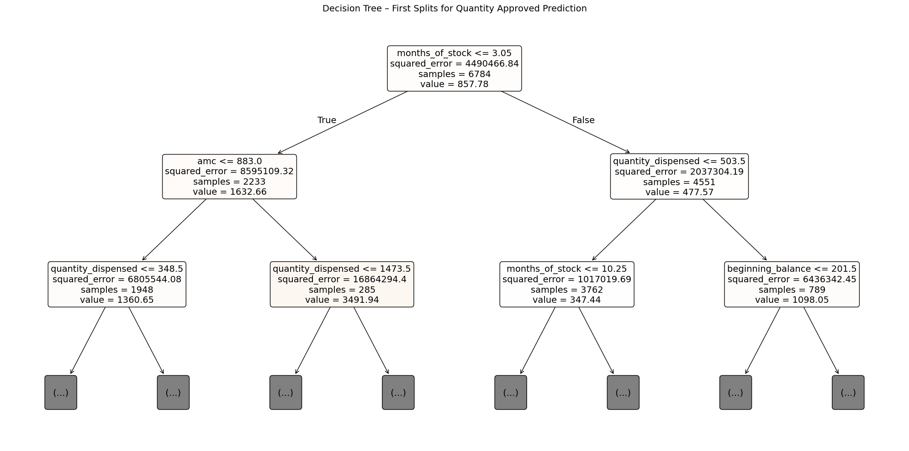
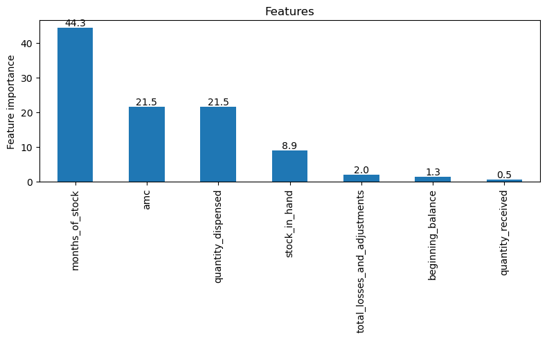

# Decision Tree and Random Forest Models for Order Quantity Prediction

## Overview

Following the Exploratory Data Analysis, feature-engineering phase, and Multiple Linear Regression (MLR) baseline model, Decision Tree and Random Forest Regression models were developed to predict the quantity of malaria commodities approved by the central supply chain or national programs (quantity_approved).

The MLR model established an interpretable baseline but demonstrated limited predictive performance, explaining approximately 15% of the variability in approved quantities on unseen test data. In addition, the EDA and MLR diagnostics identified weak or irregular linear relationships, non-normal residuals, heteroscedasticity, and evidence that some relationships between inventory characteristics and approved quantities may be non-linear.

Decision Tree Regression was therefore introduced to determine whether threshold effects and interactions among inventory, consumption, product, facility, geographic, and temporal predictors could improve prediction. Random Forest Regression was subsequently evaluated to determine whether combining multiple trees could improve predictive stability and generalization.

To ensure a consistent comparison, all three models were evaluated on the same test observations using R², Mean Absolute Error (MAE), and Root Mean Squared Error (RMSE).

## Key Insights

### Problem Statement

**Can Decision Tree and Random Forest models capable of capturing non-linear relationships, interactions, and decision thresholds materially improve prediction of approved malaria commodity quantities compared with the MLR baseline?**

### Proposed Solution

The machine-learning modeling process consisted of:

- using the same training and test observations established for the MLR baseline;
- constructing an initial Decision Tree model;
- evaluating and controlling Decision Tree overfitting through hyperparameter tuning;
- examining the structure and feature importance of the optimized tree;
- using the Decision Tree results to define a targeted Random Forest hyperparameter search;
- optimizing the Random Forest using cross-validation;
- evaluating Random Forest performance on unseen test observations;
- comparing MLR, Decision Tree, and Random Forest using R², MAE, and RMSE;
- examining predictor importance to identify the logistics information most strongly used by the tree-based models.

## Decision Tree Regression

### Initial Decision Tree

The unrestricted Decision Tree produced poor predictive performance:

| Metric | Initial Decision Tree |
|---------|-----------------------|
| R² |-0.776 |
| MAE | 1,328.73 |
| RMSE | 2,727.39 |

The negative R² indicates that the unrestricted Decision Tree generalized poorly to unseen observations. The model was therefore considered substantially overfit, demonstrating the need to control tree complexity.

However, visualization of the upper tree levels revealed potentially important operational relationships.

### Months of Stock as the Primary Decision Variable

months_of_stock was selected as the root predictor, with an initial threshold of approximately:

The threshold of 3.05 months separated observations into substantially different average approved quantities:

| Stock coverage | Observations | Average quantity approved|
|----------------|----------------|----------------|
| MoS ≤ 3.05 | 2,233| 1,632.66|
| MoS > 3.05 | 4,551 | 477.57|

Observations with approximately three months of stock or less therefore received substantially larger approved quantities on average than observations with higher stock coverage.

Within the lower-MoS branch, AMC provided another important separation:

|Consumption level | Observations |Average quantity approved|
|------------------|--------------|-------------------------|
| AMC ≤ 883 | 1,948 | 1,360.65 |
| AMC > 883 | 285 | 3,491.94 |

This indicates an interaction between stock coverage and consumption: among observations already characterized by relatively low stock coverage, those with very high average monthly consumption were associated with substantially larger approved quantities.

These findings suggest that allocation is not associated with inventory variables only through independent linear effects. Instead, the Decision Tree identifies conditional and threshold-dependent relationships between stock position and consumption.

### Tuned Decision Tree

The tuned model produced:

| Dataset  | R²    | MAE      | RMSE     |
| -------- | ----- | -------- | -------- |
| Training | 0.186 | 982.79   | 1,912.38 |
| Test     | 0.120 | 1,014.09 | 1,919.74 |

Tuning the tree to a `max_depth =5` and requiring at least 20 observations per terminal leaf,`min_samples_leaf` substantially reduced the severe overfitting observed in the unrestricted model.

The relatively close training and test MAE and RMSE indicate considerably more stable generalization. Nevertheless, test R² remained low at approximately 0.12.

Compared with the MLR baseline, the tuned Decision Tree fitted the training data better but performed slightly worse on unseen test data. **The additional flexibility of a single tree therefore did not translate into superior overall predictive performance.**

### Decision Tree Feature Importance

Feature-importance analysis shows that the tuned Decision Tree relies predominantly on stock coverage and consumption-related predictors.

The four leading stock and consumption predictors Months of Stock, AMC,Quantity Dispensed,Stock in Hand,Total Losses & Adjustments,Beginning Balance and Quantity Received) account for approximately for 96.2% of total feature importance, with Months of Stock alone contributes approximately 44.3%, making it the dominant predictor in the Decision Tree.

This result is particularly important when compared with MLR. In the linear model, Months of Stock exhibited only a small linear coefficient, whereas the Decision Tree selected it as the root predictor. This suggests that the relationship between stock coverage and approved quantities is more effectively represented through thresholds and interactions than through a single constant linear slope.

All categorical predictors received zero importance in the tuned tree. This does not demonstrate that product group, facility type, reporting period, geographic area, seasonality, or stock status have no relationship with approved quantities. Rather, they did not provide sufficient additional reduction in prediction error to be selected within the constrained tree.

Stock status is particularly noteworthy because it is derived directly from Months of Stock. By using the continuous MoS variable, the Decision Tree can identify its own predictive thresholds rather than relying on predefined stock-status categories.

## Random Forest Regression

The Random Forest hyperparameter search was designed around the optimal Decision Tree configuration to reduce computational cost while allowing additional flexibility and diversity across individual trees.

The search evaluated tree depth, number of predictors considered at each split, bootstrap sample size, minimum samples per split, minimum samples per leaf, and number of estimators.

Randomized cross-validation evaluated 60 parameter combinations using five folds, corresponding to 300 model fits. The selected model therefore consists of 300 moderately constrained trees. Each tree uses a bootstrap sample corresponding to 80% of the training observations, while depth and minimum-leaf restrictions reduce the risk of reproducing the severe overfitting observed in the unrestricted Decision Tree.

#### Random Forest Performance

The optimized Random Forest produced:

| Dataset  | R²    | MAE      | RMSE     |
| -------- | ----- | -------- | -------- |
| Training | 0.203 | 966.50   | 1,891.64 |
| Test     | 0.153 | 1,008.61 | 1,883.20 |

The model explains approximately 20.3% of the variability in the training dataset and 15.3% in unseen test observations.

Although training performance remains better than test performance, the difference is moderate, and test performance is substantially more stable than that of the initial unrestricted Decision Tree.

## Final Model Comparison

The same test observations were used to compare the three modeling approaches.

| Model | Test R² | Test MAE | Test RMSE|
|-------|-------|-------|-------|-------|
|Multiple Linear Regression| 0.153| 1,019.58| 1,883.14|
|Decision Tree | 0.120 | 1,014.09 | 1,919.74 |
|Random Forest | 0.153 | 1,008.61 | 1,883.20 |

- MLR and Random Forest achieved essentially equivalent test R² values of approximately 0.15, meaning that both models explain approximately 15% of the variability in approved quantities.
- Moving from a linear model to increasingly flexible machine-learning approaches therefore **did not materially increase the proportion of variability explained**

## Key Findings

The Decision Tree and Random Forest analysis produced five principal findings.

1. Non-linear inventory relationships are present

Decision Tree analysis identified meaningful threshold-dependent relationships that were not evident from the MLR coefficients alone.

Most notably, Months of Stock was selected as the root predictor despite having only a small linear coefficient in MLR.

2. Stock coverage and consumption dominate the observable predictive signal

In the tuned Decision Tree, the variables: Months of Stock, AMC, quantity dispensed, and stock in hand dominate the tree-based models; accounted for approximately 96% of total feature importance.

3. A single Decision Tree does not outperform the MLR baseline

Although the Decision Tree captured operationally meaningful thresholds and interactions, its test R² of approximately 0.12 was lower than the MLR baseline of approximately 0.15.

4. Random Forest provides the best average prediction error, but the improvement is marginal

Random Forest achieved the lowest MAE of approximately 1,009 units while maintaining an R² of approximately 0.15. It can therefore be retained as the preferred predictive model among the three approaches.

5. Increasing model complexity does not resolve the limited predictability of allocation decisions

The progression from **MLR -> Decision Tree -> Random Forest** did not produce a substantial improvement in test-set explanatory power.

The consistently low predictive performance across linear and more flexible non-linear models suggests that model complexity is not the principal limitation.

Rather, the observed central-level allocation decisions are not sufficiently explained by the operational predictors available in the analytical dataset.

Since commodity allocation would normally be expected to follow identifiable supply-chain rules based on factors such as consumption, available stock, stock coverage, and replenishment needs, the findings may indicate that allocation practices are not consistently aligned with a systematic operational decision framework.

## Final Model Selection

Random Forest Regression is retained as the preferred predictive model, primarily because it achieved the lowest test MAE while maintaining the highest observed R² and allowing non-linear relationships and interactions among logistics predictors. But MLR can be also used in this scenario, in case we neeed strong tracability over performance.

The final test performance is:

**`Random Forest: R² = 0.153 | MAE = 1,008.61 units | RMSE = 1,883.20 units`**

Nevertheless, Random Forest should not be interpreted as a highly accurate automated allocation model. Approximately 85% of the observed variability in approved quantities remains unexplained.

The model is therefore more appropriate as an analytical or decision-support tool than as an automated mechanism for determining approved quantities.

Its strongest contribution is twofold:

- identifying stock coverage and consumption as the dominant observable predictors of allocation;

- demonstrating that even when non-linearities and interactions are modeled, the available predictors remain insufficient to accurately reconstruct the overall allocation decision.

Future analysis should therefore focus less on increasing algorithmic complexity and more on investigating additional determinants of allocation and assessing the consistency between actual allocation practices and established replenishment rules.
