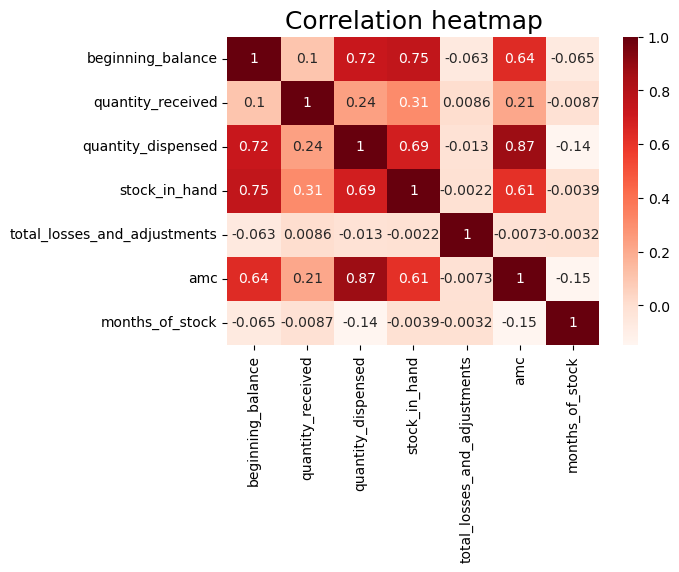
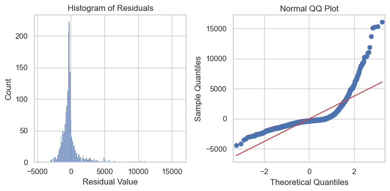
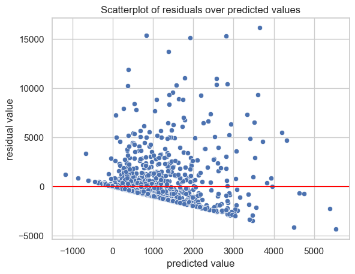

# Multiple Linear Regression Model for Order Quantity Prediction

## Overview

Following the Exploratory Data Analysis and feature-engineering phase, a Multiple Linear Regression (MLR) model was developed as the first predictive model for estimating the quantity of malaria commodities approved by the central supply chain. The objective is to assess how well inventory, product, facility, geographic, and temporal characteristics can collectively predict central-level allocation decisions.

The previous EDA established that the prediction problem contains substantial skewness, extreme observations, categorical structure, seasonality, and potentially non-linear relationships between predictors and the target. It therefore recommended MLR as an interpretable baseline, followed by Decision Tree and Random Forest models capable of representing more complex relationships.

The MLR analysis followed three main stages:

- verification of model assumptions,
- model construction and evaluation,
- and interpretation of model performance.

## Key Insights

### Problem Statement

The EDA showed individual numerical predictors generally exhibit weak, irregular, or non-linear relationships with `quantity_approved`.

MLR was therefore used to determine whether the combined linear contribution of these predictors could provide sufficient predictive information. Beyond its predictive performance, the model provides a transparent benchmark against which the additional complexity of Decision Tree and Random Forest models can subsequently be evaluated.

### Proposed Solution

The MLR modeling process included:

- pre-model assessment of linearity, independence, and multicollinearity
- preparation of the modeling dataset, including removal of observations with undefined months_of_stock
- preprocessing and encoding of categorical predictors
- an 80/20 training-test split
- model fitting on the training dataset
- evaluation of the model performance
- post-model assessment of residual normality and homoscedasticity

### Model Assumption Assessment

1. Linearity
   The preliminary EDA indicated that most continuous predictors do not exhibit strong simple linear relationships with quantity_approved. This did not prevent MLR from being evaluated, since multiple regression assesses the combined linear contribution of several predictors rather than individual bivariate relationships alone.

2. Independence
   Independence was primarily assessed from the operational structure of the dataset. Each observation represents a product-level record associated with a requisition/reporting period. This operational structure supported proceeding with MLR under the working assumption of independent observations.
3. Multicollinearity
   The correlation analysis identified several relationships among inventory predictors. The strongest was between `quantity_dispensed and amc (r = 0.87)`, which is operationally expected because AMC is derived from historical quantities dispensed.
   
   Although this indicated moderate multicollinearity, it was not considered sufficiently severe to exclude quantity_dispensed from the baseline model.

### Model Performance

1. Training Performance
   The MLR model produced the following performance on the training dataset:

| Metric   |  Training result |
| -------- | ---------------: |
| **R²**   |        **0.142** |
| **MAE**  |     **1,016.66** |
| **MSE**  | **3,852,310.71** |
| **RMSE** |     **1,962.73** |

The coefficient of determination indicates that the model explains approximately **14.2%** of the variability in approved quantities. Consequently, approximately **85.8%** of the observed variability is not explained by the current linear specification.

The MAE indicates an average absolute prediction error of approximately 1,017 units. The substantially higher RMSE of approximately 1,963 units indicates that some observations generate particularly large prediction errors, consistent with the extreme approved quantities identified during the EDA.

2. Performance on Unseen Test Data
   The model was subsequently evaluated on the test dataset:

| Metric   |     Training |             Test |
| -------- | -----------: | ---------------: |
| **R²**   |        0.142 |        **0.153** |
| **MAE**  |     1,016.66 |     **1,019.58** |
| **MSE**  | 3,852,310.71 | **3,546,251.92** |
| **RMSE** |     1,962.73 |     **1,883.15** |

The test R² of approximately 15.3% is close to the training R² of 14.2%. Similarly, MAE remains almost unchanged between training and test observations.
The similarity between training and test performance indicates no substantial evidence of overfitting.

### Model coefficients

- For the continuous predictors, consumption-related variables dominate. quantity_dispensed has the strongest positive coefficient, followed by AMC, while stock_in_hand provides the strongest negative association. This suggests that the model associates higher consumption with larger allocations and higher remaining inventory with smaller allocations.
- For the categorical predictors, stock_status clearly produces the largest differences relative to its reference category. Critical (+905.67), Stockout (+516.24), and Low (+444.51) are considerably larger than the coefficients associated with product group, facility type, geography, or reporting month.

### Residual Diagnostics

1. Residual Normality
   Post-model diagnostics show that the residuals do not follow an approximately normal distribution. The histogram is strongly concentrated around zero but presents a pronounced positive tail, including several exceptionally large positive residuals.

The Q-Q plot confirms this finding. Residuals depart substantially from the theoretical normality line, particularly in the upper tail, indicating heavy tails and large positive prediction errors.

The graphical evidence therefore indicates that the residual normality assumption is not satisfied. This does not itself explain the low R², but it limits classical inference based on normal-error assumptions and reinforces evidence that the fitted linear model does not fully represent the observed allocation process.

2. Homoscedasticity
   The residual-versus-predicted plot also reveals a clear change in residual dispersion across fitted values. Residuals are relatively concentrated for smaller predicted quantities but become substantially more dispersed as predicted quantities increase.
   

   The model performs less uniformly across the allocation range, with particularly large errors associated with some higher-volume approvals, meaning that prediction-error variance is not constant across the range of predicted approved quantities.

## Key Findings

The MLR analysis produced four main findings.

1. The model demonstrates limited explanatory and predictive power, explaining only approximately 14–15% of the variability in approved quantities on both training and unseen test data.
2. The close training and test results indicate that the primary limitation is not overfitting. Rather, the model appears to underfit the allocation process, suggesting that the relationships between supply-chain predictors and approved quantities cannot be adequately represented through the current linear specification alone
3. The residual diagnostics identify important departures from MLR assumptions. Residuals are strongly non-normal and right-skewed, while their variance changes substantially across fitted values. Large positive residuals further indicate that the model has difficulty predicting some exceptionally high approved quantities
4. These findings are aligned with the preceding EDA, which identified weak or irregular linear relationships between individual predictors and the target and anticipated that more flexible models m

## MLR as the Reference Model

Despite its relatively low predictive performance, the MLR model plays an important role in the overall modeling framework.

Rather than being considered an unsuccessful model, it establishes an interpretable reference model against which more advanced algorithms can be evaluated. Its results provide a quantitative baseline:

**Baseline MLR: Test R² = 0.153, MAE ≈ 1,020 units, RMSE ≈ 1,883 units.**

- For the continuous predictors, consumption-related variables dominate. `quantity_dispensed` has the strongest positive coefficient, followed by `AMC`, while `stock_in_hand` provides the strongest negative association. This suggests that the model associates higher consumption with larger allocations and higher remaining inventory with smaller allocations.
- For the categorical predictors, stock_status clearly produces the largest differences relative to its reference category. Critical, Stockout , and Low stock level are considerably larger than the coefficients associated with product group, facility type, geography, or reporting month.

As the model explains only approximately 14–15% of the variability in approved quantities. The coefficients therefore provide an interpretable description of the linear relationships captured by the MLR baseline, while the relatively low predictive performance supports evaluating more flexible Decision

The next models should therefore be evaluated using the same test observations and the same core performance metrics. This will allow improvements to be attributed to the modeling approach rather than differences in evaluation data.

The comparison should answer a central modeling question:
**Can models capable of capturing non-linear relationships, interactions and threshold effects materially improve the prediction of approved malaria commodity quantities compared with the linear baseline?**

## Next Steps

The next stage will develop a Decision Tree Regression model, which can represent non-linear relationships and decision thresholds without requiring the same linearity and homoscedasticity assumptions as MLR.

A Random Forest Regression model will subsequently combine multiple decision trees to improve predictive stability and potentially capture more complex interactions among consumption, stock position, product characteristics, facility context, geography, and seasonality.

This progressive approach maintains an important balance between interpretability and predictive performance, while keeping the ultimate objective focused on developing a reliable decision-support model for central-level malaria commodity allocation.
